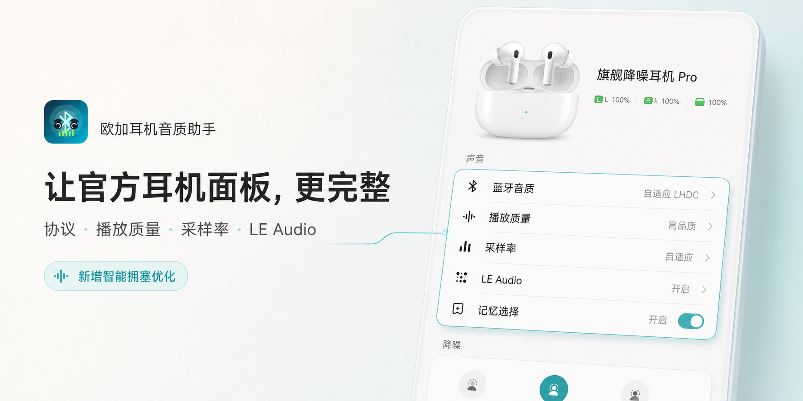

# 欧加耳机音质助手

<p align="center">
  
</p>

<p align="center">
  <a href="https://github.com/Andrea-lyz/MelodyCodecTweaker/releases/latest">下载最新版</a> ·
  <a href="https://github.com/Andrea-lyz/MelodyCodecTweaker/issues">问题反馈</a> ·
  <a href="https://github.com/Xposed-Modules-Repo/xyz.melodylsp.codec">Xposed Modules Repo</a>
</p>

`MelodyCodecTweaker` 是一个面向 OPPO / OnePlus「无线耳机」App 的 LSPosed 模块。它不会替换系统文件，也不会修改「无线耳机」App 安装包，而是在运行时注入音质控制项，让部分原本藏在系统蓝牙栈里的编解码器、播放质量、采样率和 LE Audio 状态可以直接在耳机控制面板里操作。

模块主要服务于 ColorOS / OPlus 系设备上的 `com.oplus.melody`，同时配合 `com.android.bluetooth` 和 `com.oplus.wirelesssettings` 作用域完成更稳定的状态读取和写入。

## 2.1.0 更新重点

- LHDC 播放质量固定为三个面向用户的策略：**自适应、连接优先、音质优先**，不再把底层质量码直接暴露给用户。
- 「自适应」继续使用 OPlus / LHDC 原有 ABR；「连接优先」请求约 500 / 560 kbps；「音质优先」以 1000 kbps 为目标，并由模块内置治理器在 1000 / 900 / 500 / 400 kbps 之间动态保护链路。
- 「自适应」和「音质优先」会在播放质量摘要中显示编码器当前码率，便于直接观察实际运行状态；「连接优先」保持简洁显示。
- 音质优先治理器同时接入编码队列、耳机卡顿回报与 Android 已解析的 Bluetooth Quality Report。它会根据 AFH 可用信道、重传和无接收统计判断何时值得重新尝试高码率，并按耳机、按 500→900 / 900→1000 边界分别学习，减少 900↔500 往返震荡。
- 降档只修改 LHDC 编码器目标码率，不触发整条 A2DP 重连或改写采样率；队列达到 90% 持续 300 ms 时保护降档，队列打满时立即处理，链路稳定后再逐级回升。
- 重新连接后的记忆回放、192 kHz 恢复和诊断状态进一步收敛；结构化诊断默认不在后台持续记录，只有用户主动开始记录问题时才限时开启。

## 支持作者

如果这个模块对你有帮助，可以扫码请我喝杯咖啡。感谢支持，也欢迎通过 Issue 或反馈包一起完善更多设备适配。


## 主要功能

- 在「无线耳机」主面板 `DetailMainActivity` 注入蓝牙音质区域。
- 在 OneSpace 快捷面板 `OneSpaceDetailActivity` 注入同一套控制项。
- 显示当前协议：SBC、AAC、LDAC、LHDC、LC3 等。
- 支持播放质量切换，例如 LHDC 的自适应、连接优先、音质优先，以及 LDAC 的 330 / 660 / 990 kbps。
- 自适应与音质优先可显示 LHDC 编码器实时码率；音质优先附带 1000 kbps 锚定的链路拥塞治理。
- 支持采样率切换，根据当前耳机和协议动态显示 44.1 / 48 / 96 / 192 kHz 等可选项。
- 播放质量和采样率会做联动修正，尽量避免写入蓝牙栈不接受的组合。
- 支持按耳机记忆选择，重新连接后自动应用上次设置。
- 支持 LE Audio 开关：开启后进入 LC3，并隐藏经典 A2DP 下的播放质量和采样率选项；关闭后恢复经典蓝牙音频状态。
- 耳机未连接、当前协议不可控、耳机不支持 Hi-Res 或 LE Audio 时，会隐藏或置灰对应选项，尽量贴近官方控件表现。
- 提供模块内置诊断页，可以查看作用域加载、页面 Hook、蓝牙桥接、无线设置桥接、native 补丁、记忆重放等状态，并可按需隐藏桌面图标。
- 提供「开始记录问题 + 生成反馈包」的复现记录流程，便于排查不同手机、系统版本、耳机型号和「无线耳机」版本带来的差异。

## 使用要求

- Android 12 及以上。
- 支持 libxposed API 101 的框架，例如新版 LSPosed。
- OPPO / OnePlus / ColorOS 系统上的「无线耳机」App：`com.oplus.melody`。
- 建议启用全部四个 LSPosed 作用域：
  - `com.oplus.melody`
  - `com.android.bluetooth`
  - `com.oplus.wirelesssettings`
  - `com.android.settings`

`com.oplus.melody` 负责页面注入和用户交互，`com.android.bluetooth` 负责更稳定地读写 A2DP 编解码器状态，`com.oplus.wirelesssettings` 负责调用系统侧 LE Audio 能力，`com.android.settings` 只用于收敛开发者选项里 LHDC V5 扩展值造成的无害日志噪音。少开作用域可能仍能部分工作，但实时切换、状态回读、LE Audio 和系统设置侧日志降噪会更容易失效。

## 安装与启用

1. 安装模块 APK。
2. 在 LSPosed 中启用模块。
3. 勾选上面四个作用域。
4. 强制停止「无线耳机」、蓝牙相关进程和无线设置，或者直接重启手机。
5. 打开「无线耳机」App，进入耳机主面板或 OneSpace 面板查看注入项。

如果只想临时停用模块，可以打开桌面图标「欧加耳机音质助手」，关闭模块总开关。关闭后需要重启「无线耳机」进程，宿主页才会完全恢复原状。

桌面图标默认显示。若不希望启动器里出现模块图标，可以在诊断页打开「隐藏桌面图标」开关；这个开关只控制 launcher alias，不会禁用模块，也不会影响 LSPosed 作用域加载或 LSPosed 管理器里的模块 UI 入口。

## 内置诊断页

模块桌面入口是内置诊断页，主要包含：

- 模块总开关。
- 隐藏桌面图标开关。
- 模块版本、手机型号、Android 版本和相关包版本。
- 「无线耳机」作用域、页面 Hook、主面板 / OneSpace 注入状态。
- 蓝牙作用域、A2DP Bridge、无线设置作用域和 LE Audio bridge 状态。
- LHDC V5 native 内存补丁、最近写入、记忆写入和重连重放状态。
- 「开始记录问题」和「生成反馈包」两个反馈操作。
- 最近结构化事件时间线。

结构化诊断默认不会在后台持续采集，也不会为了记录日志反复启动模块进程。点击「开始记录问题」后会开启最长 30 分钟的限时记录；生成反馈包后立即结束，超时后也会自动停止。诊断状态显示「尚未采集」只代表当前记录中还没有对应事件，不代表模块或 LSPosed 作用域没有生效。

如果出现「页面没有注入」「切换失败」「LE Audio 状态不刷新」「重连后记忆没有恢复」这类问题，建议先点「开始记录问题」，复现一次问题，再点「生成反馈包」。诊断页截图也仍然有用，可以快速判断是作用域没生效、页面 Hook 丢了、蓝牙桥没收到、native 补丁没命中，还是无线设置桥没工作。

## 一键反馈包

诊断页里的「生成反馈包」会生成：

```text
OPlusHeadsetAudioHelper-feedback-YYYYMMDD-HHMMSS.zip
```

优先保存到：

```text
/storage/emulated/0/
```

如果系统不允许直接写入根目录，会降级保存到：

```text
/storage/emulated/0/Download/
```

建议反馈前按这个流程操作，普通用户按顺序做即可：

1. 确认 LSPosed 里已经启用模块，并勾选 `com.oplus.melody`、`com.android.bluetooth`、`com.oplus.wirelesssettings`、`com.android.settings` 四个作用域。
2. 在 KernelSU / Magisk / APatch 等 root 管理器里给「欧加耳机音质助手」授权 root；没有 root 授权时也能生成反馈包，但会缺少最关键的蓝牙栈日志。
3. 打开「欧加耳机音质助手」诊断页，点击「开始记录问题」。如果弹出 root 授权请求，请选择允许。
4. 回到「无线耳机」页面复现一次问题，例如切换 LHDC 质量 / 采样率、切换 AAC / SBC / LHDC、断开重连耳机、开关 LE Audio，或等待出现「未适配，请联系开发者反馈」。
5. 再回到诊断页，点击「生成反馈包」。
6. 把生成的 `OPlusHeadsetAudioHelper-feedback-YYYYMMDD-HHMMSS.zip` 发给开发者即可。

如果是为了适配 LHDC V5 native 内存补丁，请同时提供手机型号、系统版本，以及当前系统的 `/system/lib64/libbluetooth_jni.so`。这个文件可以通过 root 文件管理器复制，也可以在电脑上用 adb 尝试导出：

```bash
adb pull /system/lib64/libbluetooth_jni.so
```

反馈包包含设备信息、模块版本、相关包版本、诊断状态、最近模块事件时间线、结构化事件 JSONL、状态快照、模块偏好、`scope.list`、`module.prop` 和模块 logcat。模块自身日志会统一脱敏蓝牙 MAC。若设备已授权 root，还会额外尝试抓取并过滤蓝牙栈相关 logcat，便于确认 `quality_mode`、`target bit rate`、`codec_specific_1`、native patch 和记忆重放情况。它不会主动打包用户文件；厂商蓝牙栈输出不受模块控制，root logcat 仍可能包含系统信息，请反馈前自行确认是否介意。

常见文件包括：

- `summary.txt`：设备、系统、模块和相关包版本概览。
- `diagnostics.txt`：诊断页状态汇总。
- `timeline.txt`：模块事件时间线，适合直接阅读。
- `events.jsonl`：结构化事件，适合后续筛选分析。
- `state.json`：当前诊断状态快照。
- `prefs.txt`：模块偏好和诊断偏好。
- `logcat-module.txt`：模块相关 logcat。
- `logcat-bluetooth-root.txt`：root 可用时抓取的蓝牙栈相关日志。

## LE Audio 说明

LE Audio 开关只会在模块判断当前设备支持时显示。判断来源包括「无线耳机」自身状态、系统蓝牙 UUID、蓝牙侧桥接回传和无线设置侧状态，避免出现「手机支持 LE Audio，但当前耳机不支持」时误显示。

开启流程：

1. 用户在「无线耳机」主面板或 OneSpace 面板点击 LE Audio。
2. 模块在当前 Melody Activity 内弹出确认对话框。
3. 用户确认后，模块再向系统侧作用域发送请求。
4. 蓝牙侧桥接设置 LE Audio connection policy，并优先调用 profile `connect(device)`；只有 profile 连接接口不可用或最终重试仍失败时才使用 OPlus transport 广播兜底，避免无条件唤起附近设备 / Live 提示。
5. 蓝牙栈完成切换后回传状态；`enabled=true` 但 profile 尚未连接时页面显示“LE Audio 正在连接”，只有 `connected=true` 才显示 `蓝牙音质: LC3`。
6. 经典 A2DP 的播放质量和采样率行隐藏。

开仓或经典 A2DP / ACL 重新连接时，如果 LE Audio policy 仍为开启但 LE profile 没有连上，蓝牙侧会进行带代际合并和冷却时间的有限重试，避免两个 Melody 进程重复轰炸连接接口。关闭 LE Audio 时，耳机通常会短暂断开并重新连回经典蓝牙音频；模块会延迟刷新 A2DP 状态，期间页面可能短暂显示等待状态，这是蓝牙栈重新协商造成的。

## 播放质量与采样率

模块优先读取系统蓝牙栈中的实时能力，而不是硬编码所有耳机档位：

- 当前协议来自 `BluetoothA2dp.getCodecStatus()`。
- 播放质量来自 `codecSpecific1` 能力。
- 采样率来自 `sampleRate` bitmask。
- 写入优先使用 `setCodecConfigPreference()` 并等待系统广播确认。

LHDC 对用户固定显示三种策略，底层映射如下：

| 面板选项 | 底层策略 | 行为 |
| --- | --- | --- |
| 自适应 | OPlus / LHDC ABR（质量码 9） | 由厂商算法预测链路并优先保证连续播放；显示编码器当前码率。 |
| 连接优先 | 固定中档（质量码 6） | 请求约 500 / 560 kbps，适合干扰较强或距离较远的环境。 |
| 音质优先 | 1000 kbps 目标（质量码 8） | 以 1000 kbps 为锚点，模块在 1000 / 900 / 500 / 400 kbps 梯度内保护和恢复；显示当前码率。 |

「音质优先」不是把 1000 kbps 永久焊死。它表达的是用户的质量上限和回升意愿：链路能承受时主动靠近 1000 kbps，出现拥塞时先保证播放连续性。与厂商「自适应」相比，它更积极追求高码率，也更依赖事后反馈；因此治理器尽量把码率切换留在编码器内部，避免重新协商 A2DP、改变 192 kHz / 24 bit 设置或产生明显断音。

治理器的主要信号与状态机：

- `getAudioQueueLengthNative()` 的编码队列由蓝牙主线程采样。队列达到容量的 90% 并持续 300 ms 时保护降档，打满时立即降档；队列低于 25% 且持续稳定 15 秒后才允许逐级升档。
- `onRemoteChoppyReport()` 提供耳机侧卡顿反馈。5 秒内连续回报会把 1000→900→500→400 的保护力度逐步加深。
- `AdapterService.bluetoothQualityReportReadyCallback(BluetoothDevice, BluetoothQualityReport)` 提供系统已经解析完成的 BQR。模块读取 `BqrCommon` 中的 AFH、retransmission、noRx、RSSI、SNR、overflow / underflow 等字段。有效采样间隔限定为 3～15 秒；升档健康窗口要求 unused AFH ≤ 39（即至少约 40 个可用信道）、重传 ≤ 25 次 / 秒且 noRx ≤ 25 次 / 秒。
- 500→900 与 900→1000 分别保存失败记录。某个边界在 5 分钟内快速失败两次后会被暂时锁住；只有连续健康 BQR 窗口、低队列和无拥塞时间同时达标，才开放一次恢复探测。
- 恢复探测失败后，证据门槛从 3 个健康窗口 / 30 秒依次提高到 5 个 / 60 秒和 10 个 / 120 秒；探测稳定 60 秒后清除该边界的失败历史。
- 所有学习状态按耳机 MAC 隔离，并在当前 `com.android.bluetooth` 进程生命周期内保留。切换耳机不会继承上一只耳机的坏链路判断。

写入路径会按能力降级：

1. Melody 进程内直接反射 A2DP 隐藏 API。
2. 通过 `com.android.bluetooth` 中注册的 AIDL bridge 写入。
3. AIDL 被 SELinux 阻止时，通过带 OPlus signature permission 和发送者身份校验的定向广播 bridge 写入。
4. 对 LDAC / 采样率尝试写入开发者选项 `Settings.Global`。
5. 最后尝试 root shell fallback。

`Settings.Global` 和 root fallback 只暂存开发者选项，不会为了强制重协商而关闭整个蓝牙适配器；模块仍会回读当前 A2DP 状态，只有实际挡位匹配才报告成功。暂存值未即时生效时，会等待下一次自然重连 / 协商，不会把 shell 退出码误当成 codec 已生效。

LHDC 的策略切换仍然依赖厂商蓝牙栈。模块会直接写入目标播放质量 / 采样率组合，避免一次切换里额外触发 A2DP 重配置。如果蓝牙栈拒绝当前组合，模块会尽量自动选择兼容采样率，例如从「连接优先 / 48 kHz」切换到「音质优先」时先提升到可用采样率。实时码率取自 `liblhdcv5BT_enc.so` 的编码器状态；没有音频流、native helper 未适配或编码器未提供读取接口时，摘要会只显示策略名称，而不会伪造数值。

## 兼容策略

「无线耳机」App 经常经过 R8 混淆，直接绑定单个类名非常容易在更新后失效。当前模块做了这些兜底：

- 优先 Hook Manifest 中相对稳定的 Activity，例如 `DetailMainActivity` 和 `OneSpaceDetailActivity`。
- 同时 Hook Melody / COUI / AndroidX 的 PreferenceFragment 形态。
- 运行时扫描 FragmentManager，查找带有目标 PreferenceScreen 标记的页面。
- 通过 Preference key、页面结构和可见分类兜底寻找注入点。
- 从 Intent、Fragment / Activity 字段以及当前 active A2DP 设备解析当前耳机，兼容从系统设置跳转进 DetailMain 的路径。
- 对没有 Hi-Res、没有 LE Audio、没有对应协议能力的设备做隐藏或禁用处理。
- 系统侧蓝牙和无线设置也做了多点 Hook，降低系统更新后单点失效概率。
- 页面快照按规范化 MAC 隔离，写入前再次核对页面、请求和实时快照属于同一耳机，避免快速切换页面时把上一只耳机的状态写给下一只。
- PreferenceScreen 去重采用弱引用；Activity 销毁（包括配置变更）会立即注销页面 receiver，异步刷新也会丢弃已销毁订阅。

这些策略能覆盖同一大版本内较多小版本更新，但模块仍然依赖厂商私有页面结构和隐藏 API，不是公开 SDK。若「无线耳机」或系统更新后彻底改掉页面结构、资源 key、包名或蓝牙实现，仍可能部分失效甚至完全失效。

给普通用户的建议：

- 非必要不要频繁更新「无线耳机」App。
- 尽量固定在已验证可用的版本。
- 更新前保留旧版 APK，方便回退。
- 更新后如果模块失效，请提供新 APK、反馈包、手机型号、系统版本、耳机型号和截图。

## 已知边界

- 模块只能控制当前耳机和系统已经协商出的 A2DP / LE Audio 能力，不能强行让耳机支持不存在的协议。
- 不支持 LE Audio 的手机或耳机不会显示 LE Audio 开关。
- 不支持 Hi-Res 或没有对应页面项的耳机会走备用注入点；如果页面结构完全不同，仍可能无法显示。
- 系统冻结 `com.oplus.wirelesssettings`、蓝牙栈重启或耳机重连期间，状态回读可能延迟几秒。
- 部分厂商蓝牙栈会拒绝特定播放质量 / 采样率组合，模块会尝试联动修正，但不能保证所有组合都能实时生效。

## 记忆回放可靠性

- Melody 的主进程和 `:fg` 进程通过文件锁动态选出唯一回放 owner，避免两个进程重复写入；owner 被系统结束后，仍存活的进程可在下一次连接事件自动接管。
- 耳机断开时会同时清理待回放、游戏模式抑制和探测状态，避免游戏中断开后永久阻止下一次回放。
- 开启「记住此耳机」时若 A2DP 尚未 ready，会在后续有效 codec snapshot 到达时补写初始快照，不再留下只有开关、没有回放值的空记录。
- 当系统明确提供可选 codec 列表时，不再强写列表中不存在的旧厂商 codec id；LHDC 不同变体只有在系统没有枚举旧 id 时才允许按 family alias 兼容。
- SBC / AAC 回放同样比较并恢复记忆采样率；AAC 不在当前可选能力中时不会强写。

## 跨进程桥安全

- Android 14 及以上的定向广播使用系统提供的 sender UID / package identity，蓝牙侧只接受 `com.oplus.melody`，Melody 侧只接受蓝牙或无线设置进程。
- Android 12 / 13 无法读取普通广播发送者身份，因此请求和响应 receiver 分别要求 OPlus component-safe 或 Bluetooth privileged signature permission；编译期 token 只做协议版本校验，不再作为安全边界。
- 蓝牙侧在真正调用 `A2dpService` 前再次校验 MAC、活动连接、codec 类型和 bitmask 能力。诊断入口也有 signature permission、消息长度、时间范围和频率限制。

## LHDC V5 运行时治理与内存补丁

当前版本在 `com.android.bluetooth` 进程中提供两层独立能力：面向「音质优先」的编码器治理器，以及兼容旧 OPlus 固定码率保护逻辑的 ARM64 指令补丁。三种用户策略不依赖旧补丁才能成立；旧补丁仍作为已验证 ROM 的兼容层保留。

治理器会解析当前已加载的 `liblhdcv5BT_enc.so` 导出符号，并在 `libbluetooth_jni.so` 的可写数据段或紧邻匿名 `.bss` 中查找 `lhdcv5BT_encode` 与 `lhdcv5BT_free_handle` 的唯一回调 owner。只有两个 owner 都唯一命中时才用原子指针替换包裹 encode / free 调用，从真实 encode 路径捕获活动 handle，再调用 `lhdcv5BT_set_target_bitrate_inx` 调整码率、通过 `lhdcv5BT_get_bitrate` 回读。它不会修改 loader entry、relocation、GOT 或可执行页；候选为零或多于一个时直接停止安装。

Java 侧将队列、remote choppy 与 BQR 归一到逐耳机链路状态，native 侧只在音质优先模式执行 1000 / 900 / 500 / 400 kbps 梯度切换。策略切换、encoder handle 更换或耳机释放都会重置对应运行时状态，避免把失效 handle 带到下一条音频流。

旧指令补丁用于处理部分 OPlus / ColorOS 蓝牙栈忽略 LHDC V5 固定 900 / 1000 kbps 目标码率的问题。启用 `com.android.bluetooth` 作用域后，模块会在蓝牙进程启动时自动尝试，仍然坚持唯一命中与失败关闭。

适配口径：

- 治理器不按手机型号写死地址。它要求 `liblhdcv5BT_enc.so` 保留四个目标导出，并要求 encode / free 回调在当前 `libbluetooth_jni.so` 可写数据区各自只有一个 owner。
- 补丁优先按 `/system/lib64/libbluetooth_jni.so` 内目标函数附近的已知机器码 pattern 命中，不按手机型号写死白名单。
- 已知 pattern 未命中时，会按 ARM64 指令语义和控制流关系识别同一个保护分支，并根据原分支目标动态生成补丁指令。编译器只改变寄存器分配、源码行号常量或分支距离时，通常不再需要为每次 OTA 单独加 pattern。
- 已离线验证一加 13 PJZ110 `16.0.9.401` 的新蓝牙库可命中；此前还实测过一加 13、一加 15、一加 Ace 6 Pro、一加 Ace 6T、一加 12，以及用户反馈的 PLC110 `C16.0.8.300`，可解除系统侧对 LHDC V5 固定 1 Mbps 目标码率的限制。
- 最终能否运行治理器、以及当前环境能否稳定维持 1000 kbps，仍取决于系统蓝牙库布局、耳机、耳机固件、采样率和无线链路。治理器未安装时会失败关闭，不会对未知 owner 或地址强行写入。

补丁流程：

- 在 `com.android.bluetooth` 进程内加载 APK 自带的 `libmelody_lhdc_patch.so`。
- 扫描当前已映射的 `/system/lib64/libbluetooth_jni.so`。
- 先按已知蓝牙库族的机器码字节特征匹配目标函数；当前已覆盖实测的 `branch_plus_69`、`branch_plus_23_op15`、`branch_plus_73_plc110`、`branch_plus_68_pjz110_1609401` 等变体。
- 已知字节特征未命中时，语义扫描器会验证共享跳转目标、`cmp #0x13`、`sub #7`、`cmp #2`、`b.hs` 和固定质量模式 4 这一组控制流约束；只有全库唯一命中才写入。
- 只有在某个已知特征或语义控制流唯一命中时，才调用 native helper 写入对应 4 字节 ARM64 指令。
- native helper 会再次核对 expected 指令，以对齐的 32 位原子写完成替换，随后执行指令缓存刷新、回读验证并恢复原内存页权限。
- 内核不允许保持可执行属性的可写映射时会安全跳过，不再临时移除 `PROT_EXEC`；权限恢复失败时会回滚原指令并再次刷新指令缓存。
- 不替换系统文件，不复制系统库，不创建 KernelSU / Magisk mount。

这里的「pattern」是 `libbluetooth_jni.so` 里目标函数附近的机器码字节特征，不是 APK 签名或系统证书签名，也不是机型名。判断能否适配时优先看已知 pattern 或语义控制流是否唯一命中；机型和系统版本只作为反馈、复现和归档参考。只有目标函数的实际逻辑或关键控制流发生变化，或扫描结果不再唯一时，才需要人工重新分析。

可通过 logcat 确认补丁状态。补丁日志只在蓝牙进程启动或重试补丁时输出一次；如果启动时没有抓到，之后再查可能没有任何输出。

PowerShell 中建议先开实时监听：

```powershell
adb logcat -c
adb logcat -v time MelodyCodecLsp:V LSPosedFramework:I '*:S' | Select-String "lhdc.memory_patch"
```

然后在另一个终端重启蓝牙进程，或直接重启手机：

```powershell
adb shell su -c "killall com.android.bluetooth"
```

Git Bash / macOS / Linux 的监听命令：

```bash
adb logcat -c
adb logcat -v time MelodyCodecLsp:V LSPosedFramework:I '*:S' | grep 'lhdc.memory_patch'
```

成功时通常能看到：

```text
evt=lhdc.memory_patch.native_loaded path=.../libmelody_lhdc_patch.so
evt=lhdc.memory_patch status=patched detail=pattern=branch_plus_69 ... success=true
```

如果蓝牙进程已经被补过，可能显示：

```text
evt=lhdc.memory_patch status=already_patched ... success=true
```

如果当前 ROM 的 `libbluetooth_jni.so` 尚未覆盖，模块会安全跳过，类似：

```text
evt=lhdc.memory_patch status=unsupported ... patched=0 original=0 success=false
```

这种情况不会替换系统文件，也不会强行写入未知地址。请提供反馈包或对应 `libbluetooth_jni.so`，后续可以按新库族补充 pattern。反馈包里的 `diagnostics.txt`、`timeline.txt`、`events.jsonl` 会记录 native patch 状态。

在支持 1 Mbps 的耳机链路上，策略写入成功后会看到 `quality_mode=HIGH1_1000(8)`；开始播放后摘要显示的是治理器回读到的实时码率。环境不支持 1000 kbps 时，治理器可能稳定停留在 900、500 或 400 kbps，这仍属于「音质优先」策略，而不是回落成「自适应」。若当前耳机或系统组合只向蓝牙栈暴露到 900 kbps，模块也会把 900 kbps 作为音质优先的有效确认结果。

如果想验证 1000 kbps，请先开实时监听，再触发一次 A2DP 重新协商，例如在模块里切到自适应后再切回音质优先，或者重连耳机。不要只在稳定播放中用 `logcat -d` 查询；encoder 不会持续输出当前码率。

```powershell
adb logcat -c
adb logcat -v time -b all | Select-String "quality_mode=HIGH1_1000|target bit rate: 8|max bit rate: 8|codec_specific_1: 32776|ignore target bitrate|write.timeout"
```

Git Bash / macOS / Linux：

```bash
adb logcat -c
adb logcat -v time -b all | grep -E 'quality_mode=HIGH1_1000|target bit rate: 8|max bit rate: 8|codec_specific_1: 32776|ignore target bitrate|write.timeout'
```

### 已过时的 KernelSU / Magisk Native 补丁

`ksu/oplus_lhdcv5_native_patch/` 保留了一份旧的 KernelSU / Magisk 兼容模块源码，只作为历史参考和极端兜底。它通过系统级 overlay 替换当前设备上的 `libbluetooth_jni.so` 副本，虽然安装时会动态匹配字节特征，但仍会创建可被检测到的 systemless mount。

常规发布不再建议打包或上传这个 KSU / Magisk zip。只有当内置运行时内存补丁无法加载或无法命中特征，且用户明确接受 KernelSU / Magisk mount 风险时，才考虑手动使用这份旧源码。

旧补丁模块不内置任何设备上的 `libbluetooth_jni.so`。刷入时它会读取当前系统的 `/system/lib64/libbluetooth_jni.so`，只有在已知原始字节特征唯一命中时才复制到模块 overlay 路径并现场改 4 字节；匹配不到或命中过多会直接中止安装，避免误修补其他 ROM 布局。安装信息会写入 `/data/adb/modules/oplus_lhdcv5_native_patch/patch-info.txt`，开机后也会通过 `OPlusLHDCV5Patch` logcat 标签输出。

如确实需要手动打包旧补丁，可从源码目录生成 zip：

```bash
cd ksu/oplus_lhdcv5_native_patch
zip -r ../../OPlus-LHDCV5-Native-Patch-0.3-dynamic-test.zip .
```

请确认 zip 内路径使用 `/` 分隔，例如 `META-INF/com/google/android/updater-script`。不要使用会生成 `META-INF\com\...` 这类反斜杠 entry 的打包方式；这类包可能仍能挂载成功，但在 KernelSU / Magisk 管理器里会显示异常路径。

## 日志排查

调试时可以抓取：

```bash
adb logcat -s MelodyCodecLsp:V
```

常见关键字：

- `evt=scope.host.start` / `evt=scope.host.context.ready`：无线耳机作用域是否加载。
- `evt=preference.fragment.hooked`：PreferenceFragment Hook 是否安装。
- `evt=detailmain.activity.hooked`：主面板 Activity Hook 是否安装。
- `evt=onespace.activity.hooked`：OneSpace Activity Hook 是否安装。
- `evt=mac.resolved`：当前耳机地址是否解析成功。
- `detailmain_fallback.injected` / `hires_anchored.injected` / `onespace.injected`：页面注入是否成功。
- `evt=scope.system.context.ready`：蓝牙作用域是否加载。
- `evt=codec.updated.hooks`：蓝牙侧编解码器更新 Hook 是否安装。
- `evt=scope.wirelesssettings.context.ready`：无线设置作用域是否加载。
- `le.melody.state.recv`：LE Audio 状态是否回传到 Melody。
- `evt=lhdc.memory_patch`：LHDC V5 运行时内存补丁加载、命中和验证状态。
- `evt=lhdc.governor.install` / `LhdcGovernorNative`：编码器回调 owner 扫描、策略切换和码率升降档。
- `evt=lhdc.bqr`：BQR 链路样本、健康窗口、当前探测上限和两个升档边界的锁定状态。
- `evt=remember.write`：按耳机记忆是否写入。
- `evt=replay.dispatch` / `evt=replay.outcome`：重连后记忆重放和确认结果。
- `evt=diag.session.start`：诊断页开始一次问题记录。
- `write.path`：播放质量 / 采样率实际走了哪条写入路径。
- `切换未生效`：蓝牙栈拒绝本次写入或回读未确认。

## 构建

项目使用 Android Gradle Plugin，目标 Java 17。release 构建当前关闭 R8，方便保留清晰的 Hook 排查路径。

本地构建：

```bash
gradle wrapper --gradle-version 8.13
./gradlew :app:assembleRelease
```

输出位置：

```text
app/build/outputs/apk/release/
```

GitHub Actions 分为两个入口：

- `Build APK`：推送 `main` / `master`、PR 或手动触发时执行，用于日常开发构建，产物名带 `dev` 和提交号。
- `Release APK`：仅手动触发。它会按 patch / minor / major 或指定版本号自动抬升 `versionName` 和 `versionCode`，构建签名 APK，提交版本号变更，创建符合 Xposed Modules Repo 规则的 `versionCode-versionName` tag（例如 `4-1.2.0`），并在 GitHub Release 中写入手填说明和自动生成的提交记录。发布工作流只会把面向用户的 README、作用域元数据和必要图片同步到 `Xposed-Modules-Repo/xyz.melodylsp.codec`，源码始终以本仓库为准；工作流需要配置 `LSP_REPO_TOKEN` secret。
- KSU / Magisk native patch 已过时，不再作为常规 Release 附件发布；如需极端兜底，可从 `ksu/oplus_lhdcv5_native_patch/` 手动生成 zip。

## 项目结构

```text
app/src/main/
├── AndroidManifest.xml
├── resources/META-INF/xposed/
│   ├── java_init.list
│   ├── module.prop
│   └── scope.list
├── aidl/xyz/melodylsp/codec/bridge/
└── java/xyz/melodylsp/codec/
    ├── MelodyCodecLspEntry.java
    ├── bt/          # A2DP 隐藏 API 反射
    ├── bridge/      # AIDL Parcelable 类型
    ├── diag/        # 结构化诊断事件、复现记录与反馈包
    ├── host/        # Melody 页面注入与 UI 控制
    ├── leaudio/     # LE Audio 状态、IPC 与无线设置桥接
    ├── storage/     # 按耳机保存记忆项
    ├── system/      # com.android.bluetooth 侧 bridge、BQR 与链路状态机
    ├── ui/          # 模块内置诊断页、总开关和桌面图标开关
    └── util/        # 日志

app/src/main/cpp/
└── native_lhdc_patch.cpp  # ARM64 安全补丁、encoder 捕获与码率治理器

docs/lsp/
├── README.md        # Xposed Modules Repo 面向普通用户的发布页
├── SCOPE
├── SOURCE_URL
└── SUMMARY

ksu/oplus_lhdcv5_native_patch/
├── META-INF/com/google/android/updater-script
├── customize.sh    # 旧兜底方案：安装时动态修补当前系统 libbluetooth_jni.so
├── module.prop
└── service.sh      # 开机后输出 patch-info 到 logcat
```

## 许可

本项目使用 Apache-2.0 License。
