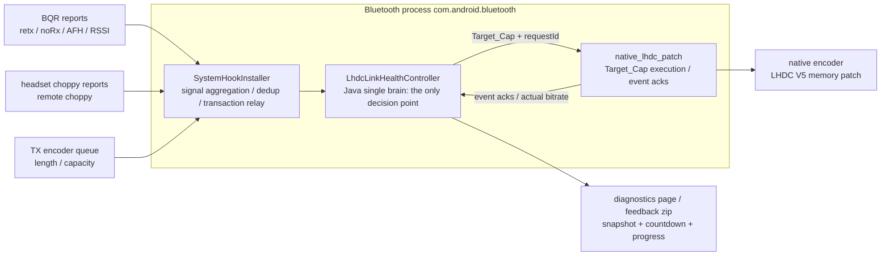
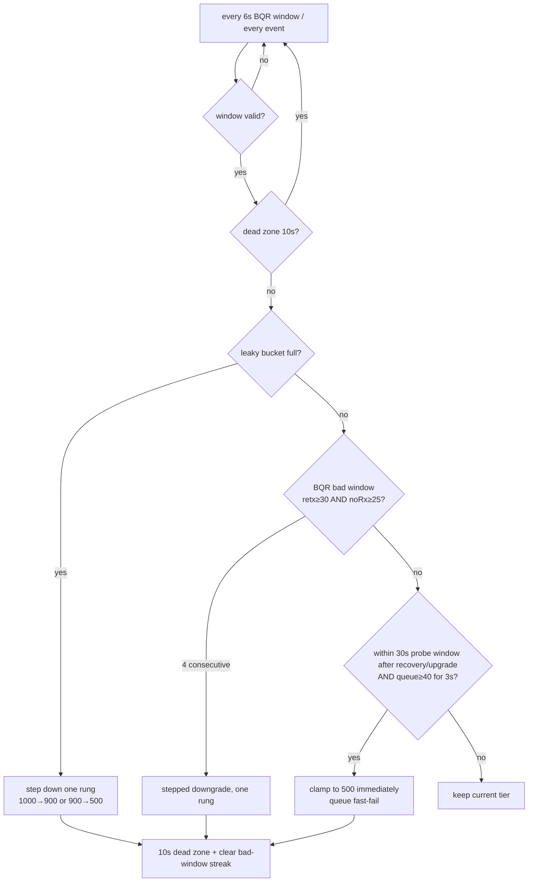
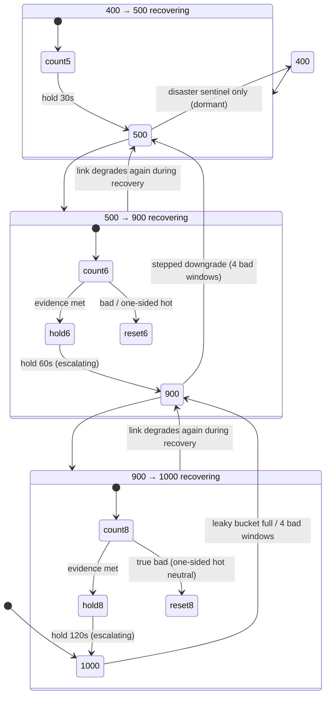
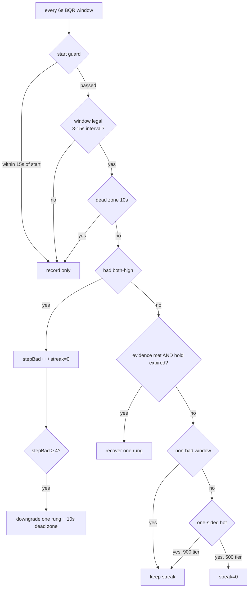

# LHDC Quality-First Governor: Algorithm and Design Notes

> The built-in **LHDC Quality-First auto-governor** of MelodyCodecTweaker
> (an OPlus/ColorOS headset audio helper, Xposed module).
> This document explains the governor's layered triggers, asymmetric recovery,
> backoff strategy and real-device calibration methodology.
> Implementation: `app/src/main/java/xyz/melodylsp/codec/system/LhdcLinkHealthController.java`
> and `app/src/main/cpp/native_lhdc_patch.cpp`. Decision log (32-48):
> `feedback/OnePlus Buds Ace 3/fix-plan-20260805-BQR-protective-downgrade.md`.

## 1. Problem statement

With "Quality-First" enabled, LHDC V5 targets **1000 kbps**. Bluetooth is a shared,
time-varying medium: grip, body occlusion and 2.4 GHz interference all move the link
quality. Clinging to 1000 kbps unconditionally means:

- under congestion, retransmissions explode and the encoder queue backs up — you hear
  stutters/choppy audio;
- after manually lowering to 500 kbps, the link never climbs back by itself and you
  have to toggle back and forth by hand.

The governor balances two goals automatically: **hold the highest bitrate as long as
possible**, and **downgrade promptly when the link degrades**, then **climb back up
asymmetrically and predictably** once the environment recovers.

```
Quality-First = target 1000 kbps, but never blindly:
                  link evidence supports  -> stay / recover to 1000
                  link evidence degrades  -> step down 1000 -> 900 -> 500
                  link recovers           -> asymmetric tiered recovery
```

## 2. System architecture



Design principles:

- **Java single brain**: every downgrade/recovery decision lives in
  `LhdcLinkHealthController`; native is stripped of independent decisions and only
  executes Target_Cap writes and reports events — one decision point, unit-testable
  and replayable offline;
- **requestId transactions**: every Target_Cap write carries a monotonically increasing
  request id; native events carry the id of the request that caused them, so Java drops
  stale acks from superseded transactions. A 2.5 s timeout falls back to the bitrate
  getter;
- **Per-headset memory**: the confirmed peer ceiling (device's real maximum, verified
  via getter) and boundary learning persist per MAC address.

## 3. Signals

| Signal | Source | Rate | Purpose |
| ---- | ---- | ---- | ---- |
| BQR (retx / noRx / AFH / RSSI) | Android Bluetooth Quality Report | ~6 s/window (valid interval 3-15 s) | hard evidence: main downgrade/recovery judge |
| remote choppy | headset-side choppy reports (1 s dedup) | event-driven | soft signal: leaky-bucket fill |
| TX encoder queue | native patch sampling | 200 ms | fast-fail and disaster sentinel |
| bitrate getter / event acks | native | after writes | transaction confirm & capability probe |

## 4. Downgrade: layered triggers

Different signals represent different stages of degradation, so the trigger strategy
is layered as well:



### 4.1 Leaky bucket (choppy soft signal)

Headset-side choppy reports (deduped within a 1 s window) are what the **user actually
perceives**. They integrate into a leaky bucket:

- each deduped event **+10**, linear decay **-0.5 / s**;
- bucket **≥ 15** (roughly 2 events within 8-10 s) triggers a one-rung downgrade;
- while any protective cap is active the bucket **does not integrate** (a recovery is
  never immediately re-triggered by stale fill);
- after a trigger the bucket is drained and a 60 s re-trigger dead zone applies.

The soft signal needs no hard evidence, but it must be **sustained** — a single burst
decays back to zero.

### 4.2 BQR stepped downgrade (hard evidence)

A window is "bad" only when **both** metrics cross the gate at the same time:

```
bad window = retx ≥ 30/s AND noRx ≥ 25/s
```

- uncapped: **4 consecutive bad windows** trigger a one-rung downgrade (1000→900, or
  900→500);
- while capped, bad windows keep accumulating (step evidence) and can step down again;
- one rung per trigger, and each tier re-accumulates its own evidence — a single blip
  can never drop straight to 500.

### 4.3 Queue fast-fail

During the **30 s probe window** after a recovery/upgrade/codec write, if the TX queue
stays at **≥ 40** (capacity 45) for **3 s**, the air cannot drain the current rate and
the governor clamps to 500 immediately — without waiting for 4 bad windows (~24 s),
protection goes from seconds to sub-second.

### 4.4 Shadow sentinels (log-only, never trigger)

Two extreme paths currently run in shadow mode — on a hit they only write calibration
logs, they never downgrade:

- **8 s leap**: a bad window aligned with a deduped choppy event within 8 s plus
  sustained high queue → candidate 1000→500;
- **disaster breaker**: noRx ≥ 110/s with queue ≥ 90% for 300 ms → candidate
  1000→400 (receiver seems deaf).

Their purpose is to **calibrate thresholds with real data**: no real 110/s sample has
ever appeared, so the 400 tier stays dormant.

### 4.5 10 s dead zone

After every downgrade, **10 s** freeze recovery evidence and bad-window streaks — the
tail of the old bitrate must not vote in the new tier, preventing fast
downgrade-upgrade ping-pong.

## 5. Recovery: asymmetric + escalating backoff

Recovery is **asymmetric by design**: the lower the tier, the faster it recovers (a low
bitrate is a temporary shelter); the higher the tier, the stricter the evidence (a high
bitrate needs a genuinely clean link):



### 5.1 The three-tier recovery ladder

| Tier path | Recovery evidence | Windows | Hold | One-sided hot window |
| ---- | ---- | ---- | ---- | ---- |
| 400 → 500 | retx ≤ 40 AND noRx ≤ 25 | 5 | 30 s | resets |
| 500 → 900 | retx < 30 AND noRx < 28 | 6 | 60 s → 120 s → 300 s | resets |
| 900 → 1000 | retx < 30 AND noRx < 25 (non-bad) | 8 | 120 s → 240 s → 300 s | **neutral** (keeps streak) |

Recovery fires only when **both** conditions hold:

```
recovery time = max(evidence satisfied, cap active time + hold)
```

### 5.2 Escalating hold (exponential backoff)

TCP-RTO-style backoff: if the link degrades **within 2 minutes of a recovery**, the next
recovery's hold escalates one level (500 tier 60→120→300 s; 900 tier 120→240→300 s). A
tier that survives for over 2 minutes resets the escalation. In marginal environments
recovery becomes slower, but **same-period oscillation is stretched exponentially until
it converges**.

### 5.3 One-sided hot windows (the calibration-driven key design)

A bad window requires **both** retx and noRx to cross their gates. A window where only
one metric is hot (e.g. retx 35/s but noRx 23/s) is a *one-sided hot window* —
physically "still talking, but retrying a lot". Handling differs per tier:

- **500 tier**: one-sided hot windows reset the streak (more conservative recovery on a
  tier whose evidence is already looser);
- **900 tier**: one-sided hot windows are **neutral** — neither counted nor reset
  (see §7 for the calibration evidence).

### 5.4 Partial recovery and peer ceiling

- after a partial recovery (500→900), the 900 tier's hold restarts from the recovery
  moment, not from a stale baseline;
- on devices whose capability is getter-confirmed at ≤ 900 kbps (B-class): the first
  downgrade drops straight to 500, recovery goes straight back to the peer ceiling, and
  1000 is never probed.

## 6. Full decision flow



## 7. Real-device calibration: why the thresholds look like this

None of the recovery thresholds are guesses — they come from **measuring the headset's
true normal band per tier**. Test rig: OnePlus 13 / PJZ110, Android 16, with an X3-family
earbud; 7 feedback rounds, windows counted per tier:

| Tier | Measured retx normal band | Measured noRx normal band |
| ---- | ---- | ---- |
| 500 kbps | 13 - 26 /s | 19 - 28 /s |
| 900 kbps | 24 - 42 /s | 21 - 29 /s |
| 1000 kbps | 27 - 47 /s | 22 - 35 /s |

The initial gates reused the strict healthy thresholds calibrated on Buds devices
(retx < 24 AND noRx < 21). On this headset those thresholds sit **inside the normal
band** — "healthy" windows rarely appeared even during normal playback, so recovery
could never complete. The gates were then relaxed per real feedback, while strictness
moved into window counts and hold duration:

| Decision | Problem | Fix |
| ---- | ---- | ---- |
| 43 | 900 tier never reached 8 consecutive <24/<21 windows in 10 min | 900 tier uses non-bad evidence (<30/<25) |
| 44 | 500 tier reset by noRx 21-25 windows | noRx relaxed to <25 |
| 45 | 900 tier reset by one-sided hot windows (retx 30-42, clean noRx) | one-sided neutrality + escalating hold on the strict tier |
| 46 | 500 tier reset by retx 24-26 windows | retx relaxed to <30 |
| 47 | 500 tier reset by noRx 27-28 windows | noRx relaxed to <28 |

Methodology: **thresholds must live outside the normal band**; in-band jitter is
filtered by window count (duration) and hold (quiet observation), not by tighter gates.

## 8. Observability

The governor treats "mechanism visibility" as a first-class requirement — users must
never mistake an automatic downgrade for a malfunction:

- **Diagnostics page**: boundary status bars (restored / recovering / waiting for lower
  tier / locked / probing) fill with recovery progress; live countdown "windows met,
  will retry in N m M s"; current-ceiling pill and evidence text;
- **Structured logs**: `evt=lhdc.governor.*` / `lhdc.link.bqr_fallback` /
  `lhdc.link.leaky_bucket_*`, each carrying cap, window counts, escalation level and hold;
- **One-tap feedback zip**: diagnostics snapshot + event JSONL + optional root Bluetooth
  stack logs, replayable offline window-by-window (the repo ships real-device replay
  tests);
- **Unit tests**: 105 state-machine tests including 7 replay cases built from real
  feedback sequences.

## 9. Known boundaries and trade-offs

- **Experimental switch (default OFF)**: the governor ships as an experimental feature.
  Release builds start with it disabled; users enable "Experimental: auto bitrate
  protection" from the module diagnostics page — the switch syncs to the bluetooth
  process immediately. Turning it off clears every active cap at once (bitrate returns to
  the peer ceiling) and stops evaluation, while choppy/BQR stay recorded for diagnostics.
- **400 tier dormant**: the disaster breaker (noRx ≥ 110/s) runs in shadow mode and a
  real sample has never been observed; if such magnitudes ever appear, the 400→500
  recovery path must be device-verified before enabling it;
- **Recovery confirmation**: the upgrade path confirms via setter ack (no getter
  double-sample window); across 7 device rounds the actual bitrate always reached the
  target on the next window — no phantom recovery observed;
- **Calibration scope**: thresholds are calibrated on A-class devices (1000-capable);
  B-class devices (peer ceiling 900) use a dedicated path (straight to 500, recovery to
  the ceiling);
- **Conservative by default**: when undecidable, keep the current tier (invalid windows
  do not count; absent evidence is not congestion).

## 10. How to try it

The governor works automatically with the module — no configuration needed. To verify
on your own device:

1. install the module and enable "Experimental: auto bitrate protection" on the
   diagnostics page (off by default);
2. enable "Quality-First" while playing music;
3. create interference (e.g. put the earbuds near a 2.4 GHz source) and watch the
   automatic downgrade and recovery;
4. check the boundary bars, recovery progress and countdown on the diagnostics page;
5. if something looks wrong, export a one-tap feedback zip and attach the device model
   and system version.
