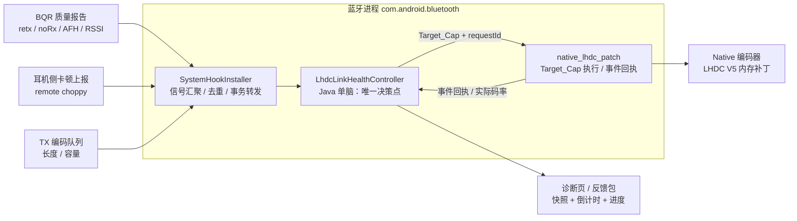
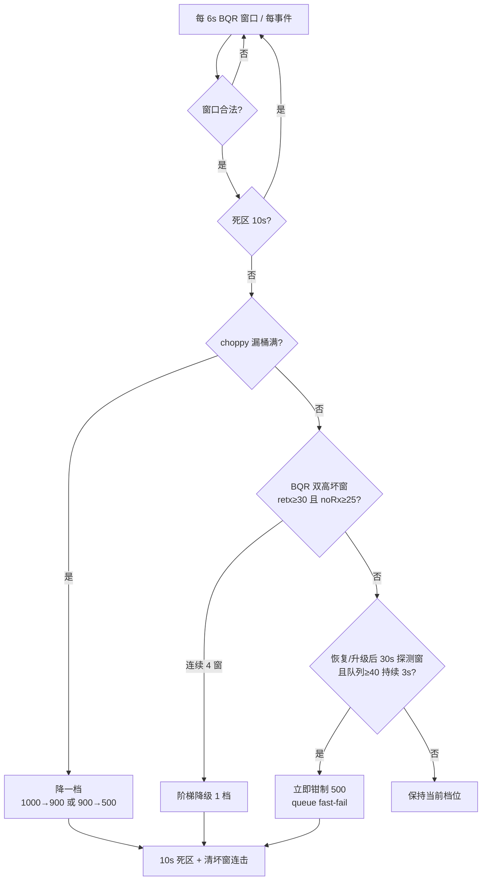
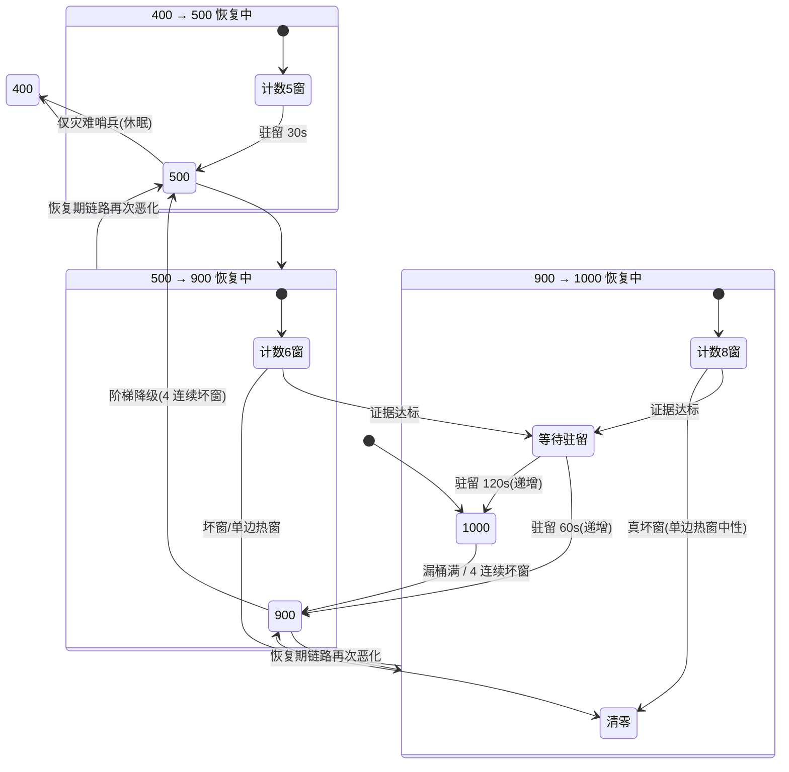
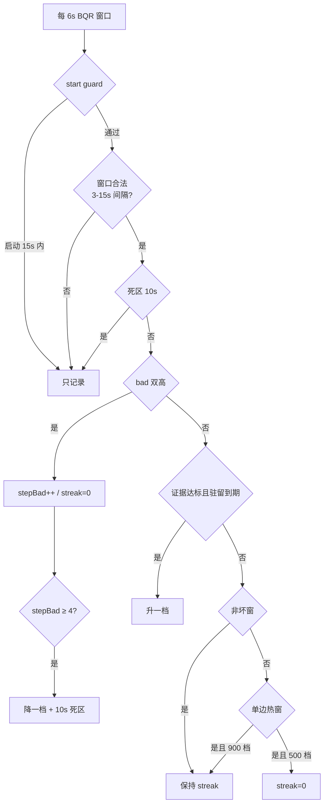

# LHDC 音质优先治理器：算法与设计说明

> MelodyCodecTweaker（欧加耳机音质助手）内置的 **LHDC 音质优先自动治理器**。
> 本文档面向开源社区，完整说明治理器的分层触发、非对称恢复、退避策略与真机校准方法。
> 实现位于 `app/src/main/java/xyz/melodylsp/codec/system/LhdcLinkHealthController.java` 与
> `app/src/main/cpp/native_lhdc_patch.cpp`；决策记录见
> `feedback/OnePlus Buds Ace 3/fix-plan-20260805-BQR-protective-downgrade.md`（决策 32-48）。

## 1. 要解决的问题

开启「音质优先」时，LHDC V5 以 **1000 kbps** 为目标码率。蓝牙链路是动态共享介质：握持方式、
人体遮挡、2.4 GHz 干扰都会让空口质量波动。若死守 1000 kbps：

- 链路拥塞时重传暴涨、编码队列堆积，听感表现为爆音/卡顿（choppy）；
- 人为降低到 500 kbps 后，环境恢复时又不会自动升回来，需要手动反复切换。

治理器的目标是在「**尽最大努力维持高码率**」与「**链路恶化时主动、及时地降级保护听感**」之间
做自动平衡，并且环境恢复后**自动、分级、可预期地升回**。

```
音质优先 = 目标 1000 kbps，但不死守：
          链路证据支持 → 保持/升回 1000
          链路证据恶化 → 阶梯降级 1000 → 900 → 500
          链路恢复     → 按档位非对称升回
```

## 2. 系统架构



设计要点：

- **Java 单脑**：所有降级/恢复决策只发生在 `LhdcLinkHealthController`，native 侧剥离独立决策，
  只负责执行目标码率写入与事件回执——单一决策点，行为可单测、可回放；
- **requestId 事务**：每次 Target_Cap 写入携带单调递增的请求号，native 事件携带触发它的请求号，
  Java 侧据此丢弃过期回执；2.5 s 无回执时以 getter（实际码率读取）兜底；
- **按耳机记忆**：peer ceiling（设备真实最高码率，经 getter 确认）与边界学习按 MAC 持久化。

## 3. 信号面

| 信号 | 来源 | 频率 | 用途 |
| ---- | ---- | ---- | ---- |
| BQR（retx / noRx / AFH / RSSI） | Android 蓝牙质量报告 | 约 6 s / 窗（有效区间 3-15 s） | 硬证据：降级与恢复的主判据 |
| remote choppy | 耳机侧卡顿回报（1 s 去重） | 事件驱动 | 软信号：漏桶积分 |
| TX 编码队列 | native 补丁采样 | 200 ms | 快失败与灾难哨兵 |
| 码率 getter / 事件回执 | native | 写入后 | 事务确认与能力检测 |

## 4. 降级机制：分层触发

不同信号代表不同的退化阶段，触发策略也分层设计：



### 4.1 漏桶（choppy 软信号）

耳机侧的卡顿回报（1 s 窗口内去重）是**用户可感知**的信号。采用漏桶积分：

- 每个去重事件 **+10**，线性衰减 **-0.5 / s**；
- 桶值 **≥ 15**（约 2 个事件落在 8-10 s 内）触发降级一档；
- 任一保护 cap 激活期间**不积分**（避免恢复刚完成就被旧事件重触发）；
- 触发后清空桶，并进入 60 s 重触发死区。

软信号不要求硬证据，但必须**持续**——瞬时爆发会随时间衰减归零。

### 4.2 BQR 阶梯降级（硬证据）

retx（重传率）与 noRx（无接收率）**同时**超过门槛才构成「坏窗」：

```
bad window = retx ≥ 30/s 且 noRx ≥ 25/s
```

- 未封顶时：**连续 4 个坏窗**触发，降一档（1000→900，或 900→500）；
- cap 激活期间坏窗继续累计（step evidence），可再次阶梯降级；
- 每次只降一档，档位间必须重新积累证据——防止一次抖动直落 500。

### 4.3 队列快失败（fast-fail）

恢复/升级/码率写入后的 **30 s 探测窗**内，若 TX 队列 ≥ 40（容量 45）且持续 **3 s**，
说明空口无法消化当前码率，立即钳制 500——不等 4 个坏窗（约 24 s），把保护从秒级提升到亚秒级。

### 4.4 Shadow 哨兵（只记录，不触发）

两条极端路径当前以 shadow 模式运行——命中时只写校准日志，不实际降级：

- **8 s 跳级**：坏窗与 choppy 在 8 s 内对齐 + 队列持续高位 → 记 1000→500 候选；
- **灾难熔断**：noRx ≥ 110/s 且队列 ≥ 90% 持续 300 ms → 记 1000→400 候选（接收端疑似失聪）。

shadow 的价值是**用真实数据校准阈值**：110/s 的样本从未出现，因此 400 档保持休眠。

### 4.5 10 s 死区

每次降档后 **10 s** 内冻结一切恢复证据与坏窗连击——旧码率尾部的伪高窗口不得参与新档位的计数，
避免「快降快升」乒乓。

## 5. 恢复机制：非对称 + 递增退避

恢复与降级**不对称**：档位越低恢复越快（低码率是临时避难所），档位越高要求越苛刻（高码率需要
真正干净的链路）：



### 5.1 三档恢复阶梯

| 档位路径 | 恢复证据 | 窗口数 | 驻留 hold | 单边热窗处理 |
| ---- | ---- | ---- | ---- | ---- |
| 400 → 500 | retx ≤ 40 且 noRx ≤ 25 | 5 | 30 s | 清零 |
| 500 → 900 | retx < 30 且 noRx < 28 | 6 | 60 s → 120 s → 300 s | 清零 |
| 900 → 1000 | retx < 30 且 noRx < 25（非坏窗） | 8 | 120 s → 240 s → 300 s | **中性**（不清零） |

恢复条件 = 「窗口数达标 **且** 驻留到期」，两者取严：

```
恢复时机 = max(证据达标时刻, cap 激活时刻 + hold)
```

### 5.2 递增驻留（指数退避）

仿 TCP RTO 退避：**恢复后 2 分钟内链路再次恶化** → 下一次恢复的驻留升级一档
（500 档 60→120→300 s；900 档 120→240→300 s）。一个档位存活超过 2 分钟才归零。
代价是临界环境下恢复变慢，收益是**同周期振荡被指数拉长直至收敛**。

### 5.3 单边热窗语义（校准驱动的关键设计）

坏窗要求 retx、noRx **双高**。只高一边的窗口（如 retx 35 但 noRx 23）称为**单边热窗**，
物理上接近「还在通话但重传较多」。处理策略按档位不同：

- **500 档**：单边热窗清零（恢复路径更保守，该档证据本就更宽）；
- **900 档**：单边热窗**中性**——不计数也不清零（见 §7 的校准依据）。

### 5.4 部分恢复与 peer ceiling

- 500→900 部分恢复后，900 档的驻留从恢复时刻重新起算（而不是沿用旧基准）；
- 设备能力经 getter 确认后（peer ceiling ≤ 900 的 B 类设备）：首次降级直落 500，
  恢复直达设备上限，且永不试探 1000。

## 6. 完整决策流程



## 7. 真机校准：为什么阈值长这样

所有恢复阈值不是拍脑袋，而是**逐档测量耳机真实常态带**后确定的。测试机
（OnePlus 13 / PJZ110，Android 16）搭配 X3 系耳机，7 轮反馈包逐窗统计：

| 档位 | 实测 retx 常态带 | 实测 noRx 常态带 |
| ---- | ---- | ---- |
| 500 kbps | 13 - 26 /s | 19 - 28 /s |
| 900 kbps | 24 - 42 /s | 21 - 29 /s |
| 1000 kbps | 27 - 47 /s | 22 - 35 /s |

最初沿用 Buds 设备校准的严格健康阈值（retx < 24 且 noRx < 21），真机发现该阈值
**位于本耳机常态带内部**——即「健康」窗口在正常播放时都不一定出现，恢复永远无法达成。
于是按三次真机反馈逐档放宽，并保留「严格性」在窗口数与驻留时长上：

| 决策 | 问题 | 修复 |
| ---- | ---- | ---- |
| 43 | 900 档 10 分钟凑不齐 8 个 <24/<21 窗 | 900 档改非坏窗判据（<30/<25） |
| 44 | 500 档 noRx 21-25 反复清零 | noRx 放宽到 <25 |
| 45 | 900 档单边热窗（retx 30-42 但 noRx 干净）清零 | 单边热窗中性化 + 严格档递增驻留 |
| 46 | 500 档 retx 24-26 反复清零 | retx 放宽到 <30 |
| 47 | 500 档 noRx 27-28 清零 | noRx 放宽到 <28 |

校准方法论：**门槛必须落在常态带之外**；带内波动交给窗口数（持续时间）和驻留（静默观察期）
来过滤，而不是用门槛卡死。

## 8. 可观测性

治理器把「机制可见」当作一等公民——避免用户把自动降级误判为故障：

- **诊断页**：边界状态条（已恢复 / 恢复中 / 等待低档恢复 / 已锁定 / 试探中）随恢复进度填充；
  实时倒计时「窗口已达标，将在 N 分 M 秒后再次尝试」；当前上限 pill 与证据文案；
- **结构化日志**：`evt=lhdc.governor.*` / `lhdc.link.bqr_fallback` / `lhdc.link.leaky_bucket_*`，
  每条带 cap、窗口计数、escalation 等级与 hold；
- **一键反馈包**：诊断快照 + 事件 JSONL + 蓝牙栈 root 日志（可选）打包，
  离线可逐窗回放复现治理行为（项目内置真机场景回放测试）；
- **单元测试**：105 项状态机测试，含 7 个基于真实反馈包窗口序列的回放用例。

## 9. 已知边界与设计取舍

- **实验性开关（默认关闭）**：治理器作为实验性功能交付。release 构建默认关闭，用户可在
  模块诊断页「实验性：自动码率保护」开启——开关立即同步到蓝牙进程；关闭时立即清除所有
  激活的 cap（码率回到设备上限）并停止评估，choppy/BQR 仍照常记录供诊断。
- **400 档休眠**：灾难熔断（noRx ≥ 110/s）以 shadow 模式运行，真实样本从未出现；
  若未来观测到该量级，需先真机验证 400 档恢复路径再启用；
- **恢复确认**：升档路径当前以 setter 回执确认（未做 getter 双样本窗），
  7 轮真机中实际码率均在下一窗口达到目标值，假恢复未发生；
- **校准范围**：阈值基于 A 类设备（支持 1000）校准；B 类设备（peer ceiling 900）
  走独立路径（首降直落 500、恢复直达上限）；
- **保守优先**：无法判定时保持当前档位（无效窗口不计、缺席证据不算拥塞）。

## 10. 如何接入本项目

治理器随模块自动工作，无需配置。若要在自己的设备上验证：

1. 安装模块，在诊断页开启「实验性：自动码率保护」（默认关闭）；
2. 开启「音质优先」，播放音乐；
3. 制造干扰（如将耳机贴近 2.4 GHz 干扰源），观察自动降级与恢复；
4. 在诊断页查看边界条、恢复进度与倒计时；
5. 出现异常时用「一键反馈包」导出，附上设备型号与系统版本。
